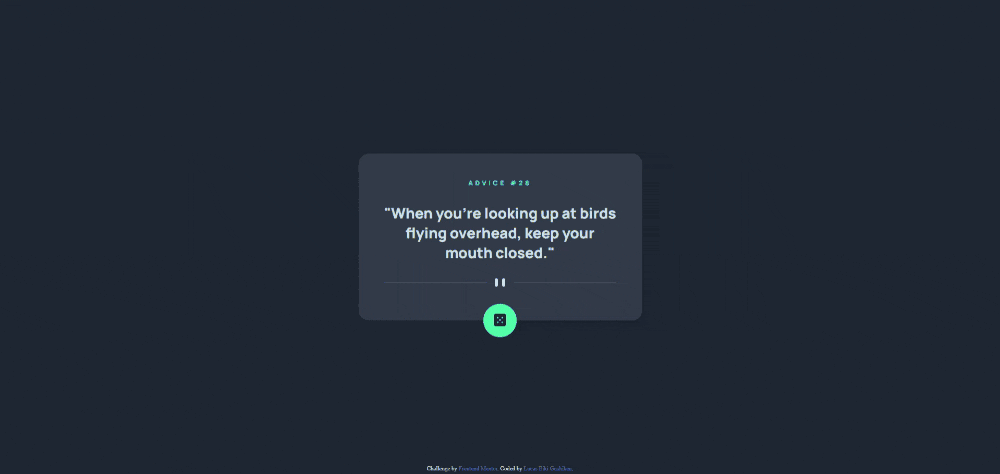

# Frontend Mentor - Advice generator app solution

Esta é uma solução do desafio [Advice generator app](https://www.frontendmentor.io/challenges/advice-generator-app-QdUG-13db) do Frontend Mentor.

## Sumário

- [Visão Geral](#visão-geral)
  - [O Desafio](#o-desafio)
  - [Screenshot](#screenshot)
  - [Links](#links)
- [Meu processo](#meu-processo)
  - [Feito com](#feito-com)
  - [Aprendizados](#aprendizados)
- [Autor](#autor)

## Visão Geral

### O Desafio

Usuários devem ser capazes de:

- Ver o layout mais otimizado dependendo do tamanho da tela do dispositivo
- Ver os elementos interativos do site
- Gerar um novo conselho ao clicar no botão de dado

### Screenshot

### Links

- Solução no Frontend Mentor: [https://www.frontendmentor.io/solutions/advice-generator-app-ds7E35PNvv](https://www.frontendmentor.io/solutions/advice-generator-app-ds7E35PNvv)
- Site: [https://eikidev.github.io/advice-generator-app/](https://eikidev.github.io/advice-generator-app/)

## Meu processo

### Feito com

- HTML5
- CSS
- Flexbox
- Javascript
- Typescript
- Jest

### Aprendizados

Este projeto foi ótimo para treinar um pouco minhas habilidades de Typescript, chamada de API's e testes unitários com Jest.

## Autor

- Linkedin - [Lucas Eiki Gushiken](www.linkedin.com/in/lucaseikigushiken)
- Frontend Mentor - [@EikiDev](https://www.frontendmentor.io/profile/EikiDev)
